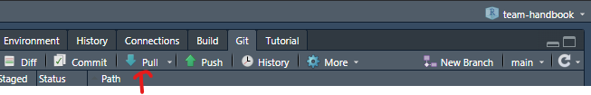

# How to

## Contribute to this handbook

The easiest way to edit the team handbook is via the GitHub user interface. 

1. Navigate to the [webpage of the public repository](https://www.github.com/camaradesberlin/team-handbook). 

2. Click on the .Rmd file you want to edit. Keep in mind that each .Rmd file corresponds to one chapter. The welcome page text is found in `index.Rmd`, while all other files are named after the corresponding chapter e.g. `01-group-culture.Rmd` or `02-team.Rmd`.

3. Click on 'Edit this file'.

4. Add/edit content of file. The easiest way to do this is to write plain text and use simple Markdown syntax for formatting (e.g., to add (sub)headings, format italics or bold, add hyperlinks or pictures, bullet points etc). If unsure, you could have a look at how other files of the handbook are formatted or consult [this](https://www.rstudio.com/wp-content/uploads/2015/02/rmarkdown-cheatsheet.pdf) or [this](https://www.github.com/adam-p/markdown-here/wiki/Markdown-Here-Cheatsheet) Markdown cheat sheet. Please don't hesitate to ask for support from the team if there any issues/questions. Once you're happy with your changes click the 'Commit changes' button.

5. You will be prompted to add a commit message. This should be a short and ideally informative message about the changes you've made to the file. A more detailed description can optionally be provided in the box below. To finalize your edits click on the 'Commit changes' button. 

## Use the R functions available on CAMARADES Berlin GitHub

### Getting started

1. Open Rstudio and create a new project using the following steps:

File > New project > Version control > Git

For repository URL add the link to the GitHub repository: (https://github.com/camaradesberlin/tools). Choose where you want this folder to be created and click on 'Create project'.

2. Install the `pacman` package if you haven't already. This will take care of loading the right libraries for the functions. You can do this by typing the following in the R console:

`install.packages("pacman")`

3. Load the function(s) you want to run. Currently, the functions are stored in separate scripts. Have a look at the [repository webpage](https://github.com/camaradesberlin/tools/) for more information on what each function does and input/output details.

For example, if you want to run the function to retrieve retraction information, type the following in the console:

`source("get_retractions.R")`
`get_retractions("path/to/citations.csv")`

### Get the latest version of the functions in case of updates

1. Open Rstudio and load the project: File > Open Project

2. In the Environment pane, click on the Git tab and then on the 'Pull' blue arrow pointing down. This will update your local repository with any changes made on the remote repository (GitHub). 

3. Load the function(s) as described in the section above.
